#implemetation of tables
```

CREATE TABLE STUDENT1 (
    Name VARCHAR2(50),
    Student_number NUMBER PRIMARY KEY,
    Class NUMBER,
    Major VARCHAR2(10) NOT NULL
);

CREATE TABLE COURSE1 (
    Course_name VARCHAR2(20),
    Course_number VARCHAR2(10) PRIMARY KEY,
    Credit_hours NUMBER NOT NULL,
    Department VARCHAR2(10)
);

CREATE TABLE SECTION1 (
    Section_identifier NUMBER PRIMARY KEY,
    Course_number VARCHAR2(10),
    Semester VARCHAR2(10) NOT NULL,
    Year NUMBER,
    Instructor VARCHAR2(20),
    FOREIGN KEY (Course_number) REFERENCES COURSE(Course_number)
);

CREATE TABLE GRADE_REPORT1 (
    Student_number NUMBER,
    Section_identifier NUMBER,
    Grade VARCHAR2(1) NOT NULL,
    PRIMARY KEY (Student_number, Section_identifier),
    FOREIGN KEY (Student_number) REFERENCES STUDENT(Student_number),
    FOREIGN KEY (Section_identifier) REFERENCES SECTION(Section_identifier)
);

CREATE TABLE PREREQUISITE (
    Course_number VARCHAR2(10),
    Prerequisite_number VARCHAR(10),
    
    PRIMARY KEY (Course_number, Prerequisite_number),
    
    FOREIGN KEY (Course_number)
        REFERENCES COURSE(Course_number),
        
    FOREIGN KEY (Prerequisite_number)
        REFERENCES COURSE(Course_number)
);
```
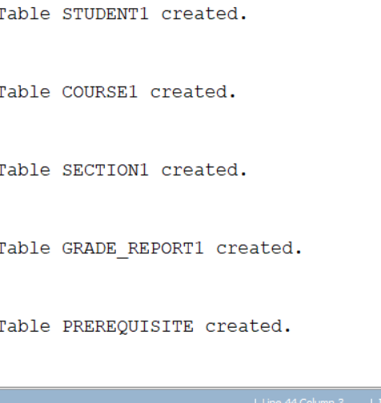
```
desc student1;
desc course1;
desc section1;
desc grade_report1;
desc prerequisite;
```


```

INSERT INTO STUDENT1 (Name, Student_number, Class, Major)
VALUES ('Smith', 17, 1, 'CS');

INSERT INTO STUDENT1 (Name, Student_number, Class, Major)
VALUES ('Brown', 8, 2, 'CS');


INSERT INTO COURSE1 (Course_name, Course_number, Credit_hours, Department)
VALUES ('Intro to Computer Science', 'CS1310', 4, 'CS');

INSERT INTO COURSE1 (Course_name, Course_number, Credit_hours, Department)
VALUES ('Data Structures', 'CS3320', 4, 'CS');

INSERT INTO COURSE1 (Course_name, Course_number, Credit_hours, Department)
VALUES ('Discrete Mathematics', 'MATH2410', 3, 'MATH');

INSERT INTO COURSE1 (Course_name, Course_number, Credit_hours, Department)
VALUES ('Database', 'CS3380', 3, 'CS');


INSERT INTO SECTION1
(Section_identifier, Course_number, Semester, Year, Instructor)
VALUES (85, 'MATH2410', 'Fall', '07', 'King');

INSERT INTO SECTION1
(Section_identifier, Course_number, Semester, Year, Instructor)
VALUES (92, 'CS1310', 'Fall', '07', 'Anderson');

INSERT INTO SECTION1
(Section_identifier, Course_number, Semester, Year, Instructor)
VALUES (102, 'CS3320', 'Spring', '08', 'Knuth');

INSERT INTO SECTION1
(Section_identifier, Course_number, Semester, Year, Instructor)
VALUES (112, 'MATH2410', 'Fall', '08', 'Chang');

INSERT INTO SECTION1
(Section_identifier, Course_number, Semester, Year, Instructor)
VALUES (119, 'CS1310', 'Fall', '08', 'Anderson');

INSERT INTO SECTION1
(Section_identifier, Course_number, Semester, Year, Instructor)
VALUES (135, 'CS3380', 'Fall', '08', 'Stone');


INSERT INTO GRADE_REPORT1
(Student_number, Section_identifier, Grade)
VALUES (17, 112, 'B');

INSERT INTO GRADE_REPORT1
(Student_number, Section_identifier, Grade)
VALUES (17, 119, 'C');

INSERT INTO GRADE_REPORT1
(Student_number, Section_identifier, Grade)
VALUES (8, 85, 'A');

INSERT INTO GRADE_REPORT1
(Student_number, Section_identifier, Grade)
VALUES (8, 92, 'A');

INSERT INTO GRADE_REPORT1
(Student_number, Section_identifier, Grade)
VALUES (8, 102, 'B');

INSERT INTO GRADE_REPORT1
(Student_number, Section_identifier, Grade)
VALUES (8, 135, 'A');


INSERT INTO PREREQUISITE
(Course_number, Prerequisite_number)
VALUES ('CS3380', 'CS3320');

INSERT INTO PREREQUISITE
(Course_number, Prerequisite_number)
VALUES ('CS3380', 'MATH2410');

INSERT INTO PREREQUISITE
(Course_number, Prerequisite_number)
VALUES ('CS3320', 'CS1310');

```
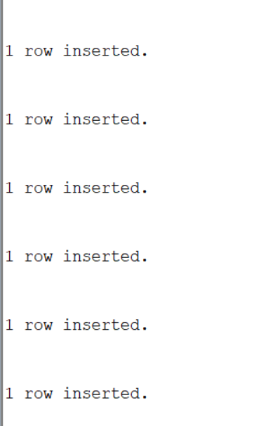
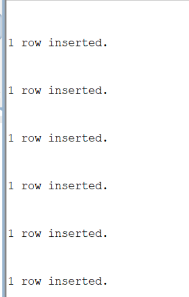
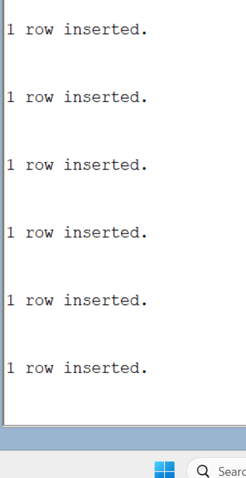
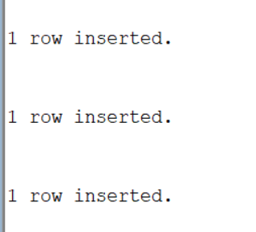

```
select *from student1;
select *from course1;
select *from section1;
select *from grade_report1;
select *from prerequisite;
```
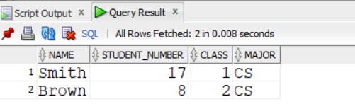
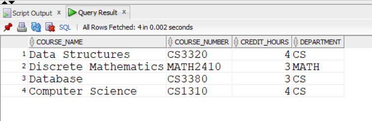
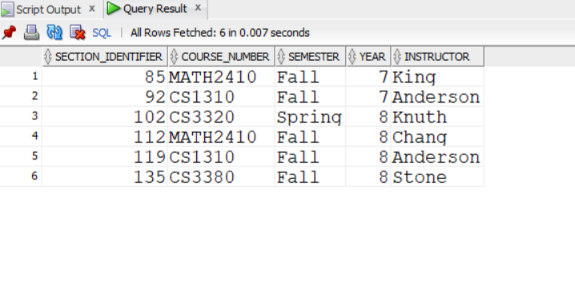
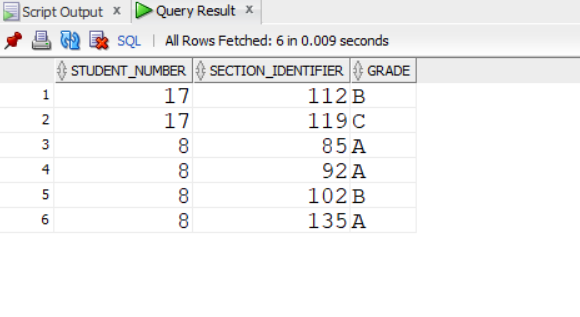
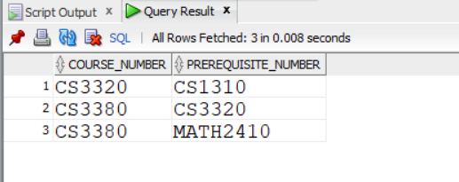

```

alter  table student1 add branch varchar2(5);
desc student1;
```


```
update student1 set branch=major;
desc student1;
select *from student1;
```
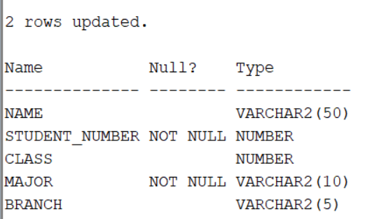
```
alter table student1
drop column major;
desc student1;
```
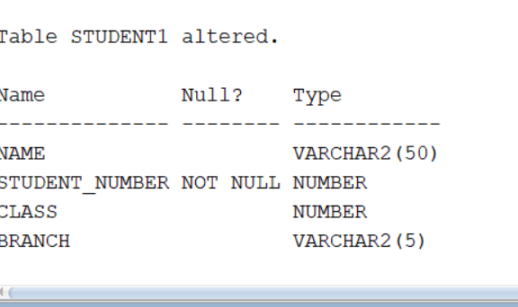
```
alter table course1
rename column course_number to CID;
desc course1;
```
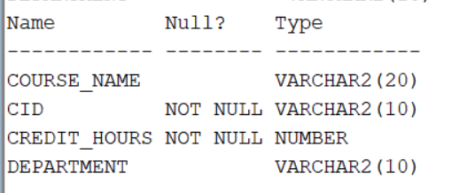
```
update course1
SET credit_hours = 4;
```

```
Alter table student1
modify branch varchar2(5) NOT NULL;
```

```
rename student1 to pupil
```

```
delete from grade_report1
where section_identifier in
(select section_identifier from section1 
where semester='Fall');

delete from section1
where semester = 'Fall';

select *from course1;
```
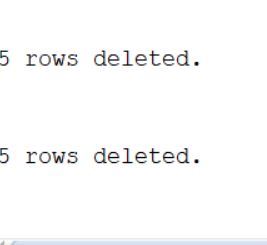
```
delete from course1 where course_name='Data Structures';
```

```
truncate table grade_report1;
truncate table prerequisite;
truncate table section1;
truncate table pupil;
truncate table course1;
```
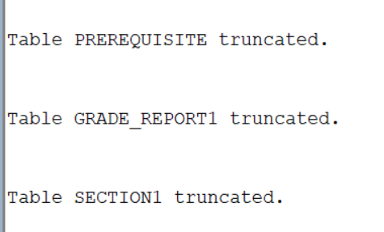
1[output](p15.png)
```
drop table grade_report1 PURGE;
drop table prerequisite PURGE;
```

```
drop table pupil;
drop table section1;
drop table course1;
```


