#EXPERIMENT NO. 2
```

CREATE TABLE SAILORS
(
 SID NUMBER PRIMARY KEY,
 SNAME VARCHAR2(40),
 RATING NUMBER,
 AGE NUMBER (4,1)
);
CREATE TABLE BOATS
(
 BID NUMBER PRIMARY KEY,
 BNAME VARCHAR2(20),
 COLOR VARCHAR2(10)
 );
CREATE TABLE RESERVES
(
 SID NUMBER,
 BID NUMBER,
 DAY DATE
 );
```
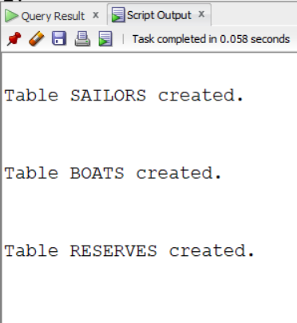
```
INSERT INTO SAILORS VALUES (22,'DUSTIN',7,45.0);
INSERT INTO SAILORS VALUES (29,'BRUTUS',1,33.0);
INSERT INTO SAILORS VALUES (31,'LUBBER',8,55.5);
INSERT INTO SAILORS VALUES (32,'ANDY',8,25.5);
INSERT INTO SAILORS VALUES (58,'RUSTY',10,35.0);
INSERT INTO SAILORS VALUES (64,'HORATIO',7,35.0);
INSERT INTO SAILORS VALUES (71,'ZORBA',10,16.0);
INSERT INTO SAILORS VALUES (74,'HORATION',9,35.0);
INSERT INTO SAILORS VALUES (85,'ART',3,25.5);
INSERT INTO SAILORS VALUES (95,'BOB',3,63.5);

INSERT INTO BOATS VALUES (101,'INTERLAKE','BLUE');
INSERT INTO BOATS VALUES (102,'INTERLAKE','RED');
INSERT INTO BOATS VALUES (103,'CLIPPER','GREEN');
INSERT INTO BOATS VALUES (104,'MARINE','RED');

INSERT INTO RESERVES VALUES(22, 102, TO_DATE('10/10/98', 'DD/MM/YY'));
INSERT INTO RESERVES VALUES(22, 103, TO_DATE('10/08/98', 'DD/MM/YY'));
INSERT INTO RESERVES VALUES(22, 104, TO_DATE('10/07/98', 'DD/MM/YY'));
INSERT INTO RESERVES VALUES(31, 102, TO_DATE('11/10/98', 'DD/MM/YY'));
INSERT INTO RESERVES VALUES(31, 103, TO_DATE('11/06/98', 'DD/MM/YY'));
INSERT INTO RESERVES VALUES(31, 104, TO_DATE('11/12/98', 'DD/MM/YY'));
INSERT INTO RESERVES VALUES(64, 101, TO_DATE('09/05/98', 'DD/MM/YY'));
INSERT INTO RESERVES VALUES(64, 102, TO_DATE('09/08/98', 'DD/MM/YY'));
INSERT INTO RESERVES VALUES(74, 103, TO_DATE('09/08/98', 'DD/MM/YY'));
```
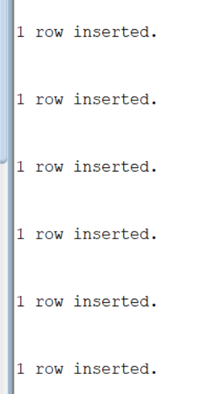
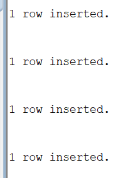


#2.1
```

SELECT sname,age,from sailors;
```
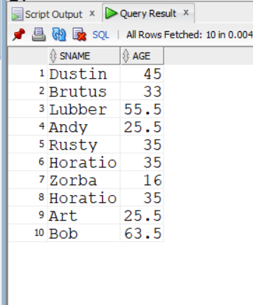
# 2.2
```
SELECT * FROM SAILORS
WHERE RATING > 7;

```
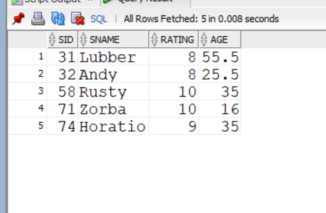
#2.3
```


SELECT S.SNAME
FROM SAILORS S, RESERVES R
WHERE S.SID = R.SID
AND R.BID = 103;
```
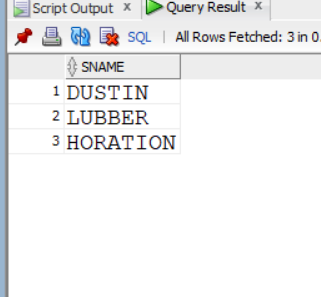

#2.4
```
SELECT S.SID
FROM SAILORS S, RESERVES R, BOATS B
WHERE S.SID = R.SID
AND R.BID = B.BID
AND B.COLOR = 'RED';
```
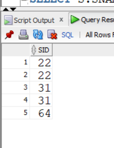
#2.5
```
SELECT S.SNAME
FROM SAILORS S, RESERVES R, BOATS B
WHERE S.SID = R.SID
AND R.BID = B.BID
AND B.COLOR = 'RED';
```
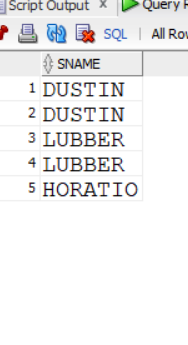
#2.6
```
SELECT B.COLOR
FROM SAILORS S, RESERVES R, BOATS B
WHERE S.SID = R.SID
AND R.BID = B.BID
AND S.SNAME = 'LUBBER';
```
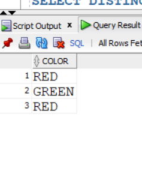
#2.7
```
SELECT DISTINCT S.SNAME 
FROM SAILORS S , RESERVES R
WHERE S.SID = R.SID;
```
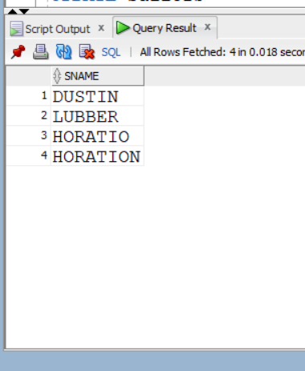
#2.8
```
UPDATE Sailors
SET RATING = RATING + 1
WHERE SID IN
(
    SELECT R1.SID
    FROM Reserves R1, Reserves R2
    WHERE R1.SID = R2.SID
      AND R1.DAY = R2.DAY
      AND R1.BID <> R2.BID
);
```
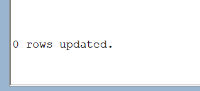
#2.9
```
SELECT AGE
FROM Sailors
WHERE SNAME LIKE 'B%B'
  AND LENGTH(SNAME) >= 3;
```
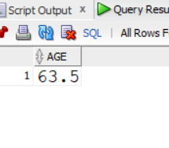
#2.10
```
SELECT DISTINCT S.SNAME
FROM Sailors S, Reserves R, Boats B
WHERE S.SID = R.SID
  AND R.BID = R.BID
  AND B.COLOR IN ('red')
UNION
SELECT DISTINCT S.SNAME
FROM Sailors S, Reserves R, Boats B
WHERE S.SID = R.SID
  AND R.BID = B.BID
  AND B.COLOR IN ('green');
```
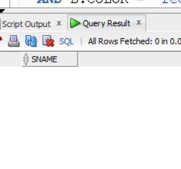
#2.11
```
  
SELECT DISTINCT S.SNAME
FROM Sailors S, Reserves R, Boats B
WHERE S.SID = R.SID
  AND R.BID = B.BID
  AND B.COLOR = 'red'
INTERSECT
SELECT DISTINCT S.SNAME
FROM Sailors S, Reserves R, Boats B
WHERE S.SID = R.SID
  AND R.BID = B.BID
  AND B.COLOR = 'green'
```
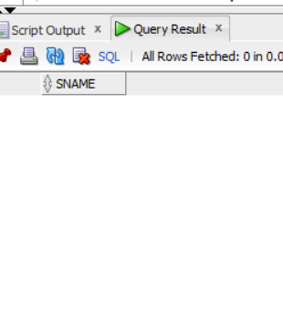
#2.12
```
  
SELECT DISTINCT R.SID
FROM Reserves R, Boats B
WHERE R.BID = B.BID
  AND B.COLOR = 'red'
MINUS
SELECT DISTINCT R.SID
FROM Reserves R, Boats B
WHERE R.BID = B.BID
  AND B.COLOR = 'green';
```
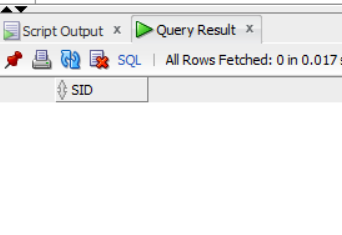
#2.13
```
SELECT SID
FROM Sailors
WHERE RATING = 10
UNION
SELECT SID
FROM Reserves
WHERE BID = 104;
```
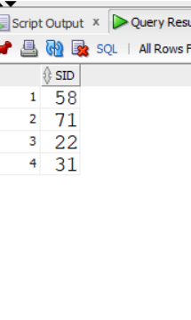
#2.14
```

SELECT S.SNAME
FROM Sailors S
WHERE S.SID IN
(
  SELECT SID
  FROM RESERVES
  WHERE BID = 103
 );
```
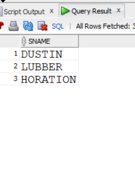
#2.15
```SELECT S.SNAME
FROM Sailors S
WHERE S.SID IN
(
    SELECT R.SID
    FROM Reserves R
    WHERE R.BID IN
    (
        SELECT B.BID
        FROM Boats B
        WHERE B.COLOR = 'red'
    )
);
```
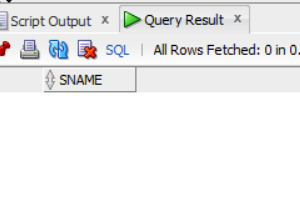
#2.16
```


SELECT S.SNAME
FROM Sailors S
WHERE S.SID IN
(
    SELECT SID
    FROM Reserves
    WHERE BID = 103
);
```
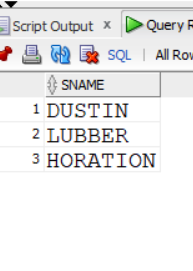
#2.17
```

SELECT * FROM Sailors
WHERE RATING > ANY
(
    SELECT RATING
    FROM Sailors
    WHERE SNAME = 'Horatio'
);
```
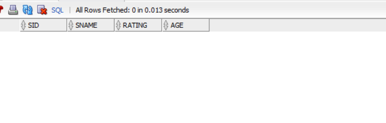
#2.18
```

SELECT * FROM Sailors
WHERE RATING > ALL
(
    SELECT RATING
    FROM Sailors
    WHERE SNAME = 'Horatio'
);
```
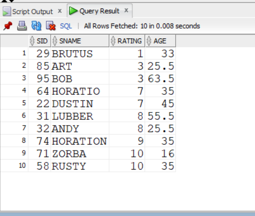

#2.19
```

SELECT * FROM Sailors
WHERE RATING = 
(
    SELECT MAX(RATING)
    FROM Sailors
);
```
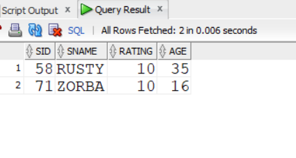
#2.20
```
SELECT DISTINCT S.SNAME
FROM SAILORS S
WHERE S.SID IN
(
    SELECT R.SID
    FROM RESERVES R
    WHERE R.BID IN
    (
        SELECT B.BID
        FROM BOATS B
        WHERE B.COLOR = 'RED'
    )
)
AND S.SID IN
(
    SELECT R.SID
    FROM RESERVES R
    WHERE R.BID IN
    (
        SELECT B.BID
        FROM BOATS B
         WHERE R.BID IN
    (
        SELECT B.BID
        FROM BOATS B
        WHERE B.COLOR = 'GREEN'
    )
);
```
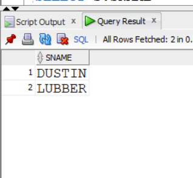
#2.21
```
SELECT S.SNAME
FROM SAILORS S, RESERVES R
WHERE S.SID = R.SID
GROUP BY S.SNAME
HAVING COUNT(DISTINCT R.BID) = (SELECT COUNT(*) FROM BOATS);

```
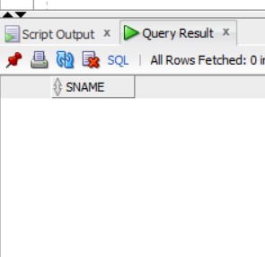
#2.22
```
SELECT AVG(AGE)
FROM Sailors;
```
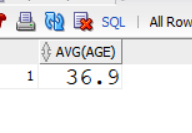
#2.23
```
SELECT AVG(AGE)
FROM SAILORS 
WHERE RATING = 10;
```
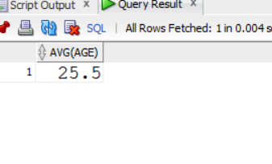
#2.24
```
SELECT SNAME, AGE
FROM Sailors
WHERE AGE =
(
    SELECT MAX(AGE)
    FROM Sailors
);
```
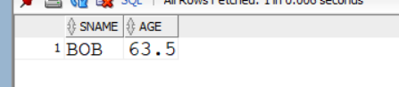
#2.25
```
SELECT COUNT (*) FROM Sailors;
```
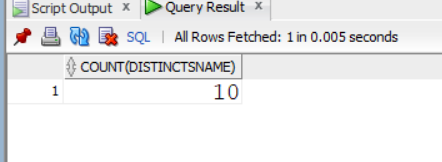
#2.26
```

SELECT COUNT (DISTINCT SNAME) 
FROM SAILORS;
```
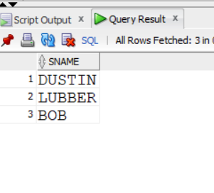
#2.27
```
SELECT SNAME
FROM Sailors 
WHERE AGE >
(
    SELECT MAX(AGE)
    FROM Sailors 
    WHERE RATING = 10
);
```
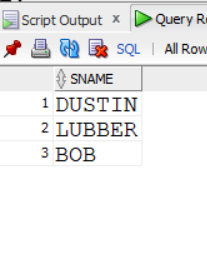
#2.28
```
SELECT RATING,MIN (AGE)
FROM SAILORS
GROUP BY RATING;
```
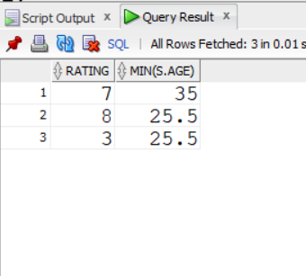
#2.29
```
SELECT S.RATING, MIN(S.AGE)
FROM Sailors S
WHERE S.age >=18
GROUP BY S.RATING
HAVING COUNT (*) >1;
```
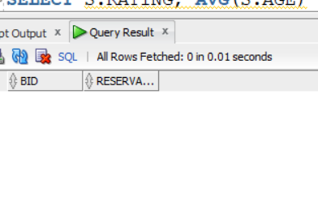
#2.30
```

SELECT B.BID, COUNT(*) AS RESERVATION_COUNT
FROM Boats B, Reserves R
WHERE R.BID = B.BID
  AND B.COLOR = 'red'
GROUP BY B.BID;
```
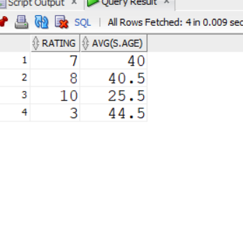
#2.31
```
SELECT S.RATING, AVG(S.AGE) 
FROM Sailors S
GROUP BY S.RATING
HAVING COUNT(*) >1;

```
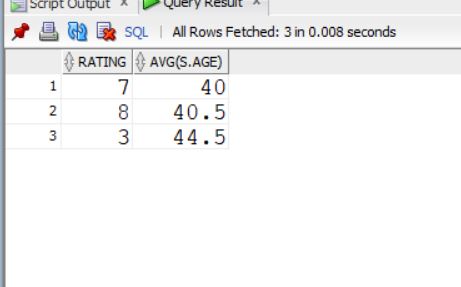
```

#2.32
```SELECT S.RATING, AVG(S.AGE) 
FROM Sailors S
WHERE S.AGE >= 18
GROUP BY S.RATING
HAVING COUNT(*) >1;
```


#2.33
```
SELECT RATING, AVG(AGE) AS AVERAGE_AGE
FROM Sailors S
WHERE S.AGE >= 18
GROUP BY S.RATING
HAVING COUNT(*) >1;
```
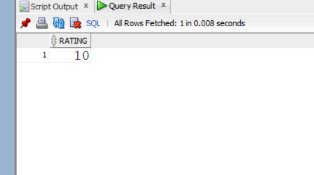

#2.34
```
SELECT S.RATING
FROM SAILORS S
GROUP BY S.RATING
HAVING AVG(S.AGE) <=ALL
(
 SELECT AVG(S2.AGE)
 FROM SAILORS S2
 GROUP BY S2.RATING
 );
```

