#experiment 3 and 4
```
CREATE TABLE employees (
    employee_id NUMBER(5),
    first_name VARCHAR2(20),
    last_name VARCHAR2(20),
    gender CHAR(1),
    job_id VARCHAR2(15),
    department VARCHAR2(30),
    salary NUMBER(8,2),
    commission NUMBER(5,2),
    hire_date DATE,
    city VARCHAR2(20)
);

INSERT INTO employees VALUES
(101, 'John', 'Smith', 'M', 'IT_PROG', 'IT', 65000, 5,
TO_DATE('15-JAN-2020', 'DD-MON-YYYY'), 'Hyderabad');

INSERT INTO employees VALUES
(102, 'Anita', 'Sharma', 'F', 'HR_REP', 'HR', 52000, 3,
TO_DATE('10-JUN-2019', 'DD-MON-YYYY'), 'Bengaluru');

INSERT INTO employees VALUES
(103, 'Rahul', 'Kumar', 'M', 'SA_REP', 'Sales', 48000, 8,
TO_DATE('25-AUG-2021', 'DD-MON-YYYY'), 'Chennai');

INSERT INTO employees VALUES
(104, 'Priya', 'Reddy', 'F', 'MK_MAN', 'Marketing', 72000, 10,
TO_DATE('05-MAR-2018', 'DD-MON-YYYY'), 'Hyderabad');

INSERT INTO employees VALUES
(105, 'David', 'Wilson', 'M', 'FI_ACCOUNT', 'Finance', 58000, NULL,
TO_DATE('18-DEC-2017', 'DD-MON-YYYY'), 'Mumbai');

INSERT INTO employees VALUES
(106, 'Sneha', 'Patel', 'F', 'IT_PROG', 'IT', 69000, 6,
TO_DATE('12-NOV-2022', 'DD-MON-YYYY'), 'Pune');

INSERT INTO employees VALUES
(107, 'Amit', 'Verma', 'M', 'SA_REP', 'Sales', 45000, 4,
TO_DATE('20-JUL-2023', 'DD-MON-YYYY'), 'Delhi');

INSERT INTO employees VALUES
(108, 'Kiran', 'Rao', 'M', 'HR_REP', 'HR', 50000, NULL,
TO_DATE('09-FEB-2021', 'DD-MON-YYYY'), 'Hyderabad');

INSERT INTO employees VALUES
(109, 'Lakshmi', 'Nair', 'F', 'IT_PROG', 'IT', 76000, 7,
TO_DATE('14-SEP-2016', 'DD-MON-YYYY'), 'Kochi');


INSERT INTO employees VALUES
(110, 'Arjun', 'Singh', 'M', 'MK_MAN', 'Marketing', 68000, 5,
TO_DATE('30-APR-2019', 'DD-MON-YYYY'), 'Jaipur');
```


```

SELECT employee_id, first_name,
TO_CHAR(hire_date, 'DD-MON-YYYY')
FROM employees;
```
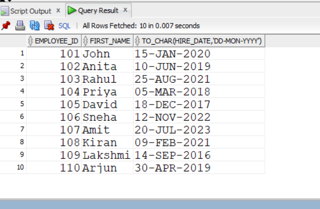
```
SELECT employee_id, first_name,
TO_CHAR(salary, '$99,999.99')
FROM employees;
```
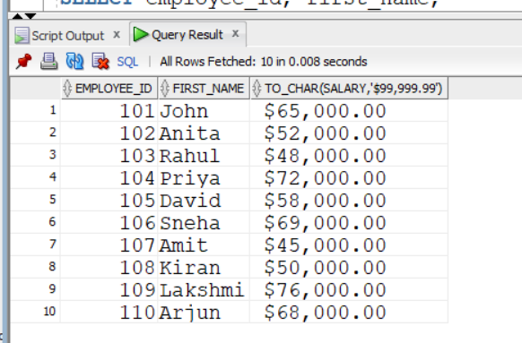
```

SELECT employee_id, first_name,
TO_NUMBER(TO_CHAR(salary)) + 5000
FROM employees;
```

```
SELECT *
FROM employees
WHERE hire_date > TO_DATE('01-JAN-2020', 'DD-MON-YYYY');
```
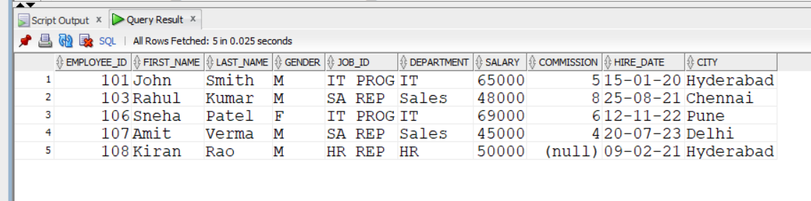
```
SELECT first_name || ' ' || last_name
FROM employees;
```

```
SELECT CONCAT(first_name, last_name)
FROM employees;
```

```

SELECT LPAD(first_name, 20, '*')
FROM employees;
```

```


SELECT RPAD(first_name, 20, '*')
FROM employees;
```

```
SELECT LTRIM(first_name)
FROM employees;
```

```
SELECT RTRIM(first_name)
FROM employees;
```
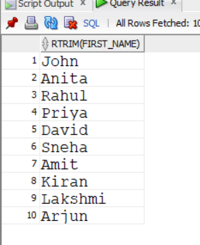
```

SELECT LOWER(first_name)
FROM employees;
```

```

SELECT UPPER(first_name)
FROM employees;
```
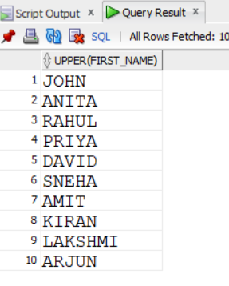
```

SELECT INITCAP(first_name)
FROM employees;
```

```

SELECT first_name, LENGTH(first_name)
FROM employees;
```

```
SELECT first_name, SUBSTR(first_name, 1, 3)
FROM employees;
```

```
SELECT first_name, INSTR(first_name, 'a')
FROM employees;
```
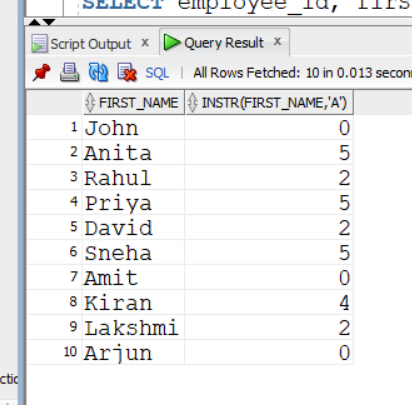
```

SELECT employee_id, first_name, last_name, SYSDATE
FROM employees;
```
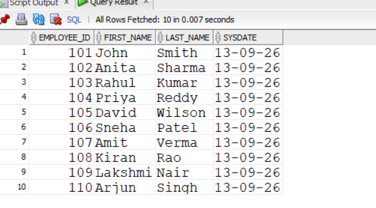
```
SELECT first_name, hire_date,
NEXT_DAY(hire_date, 'MONDAY')
FROM employees;
```
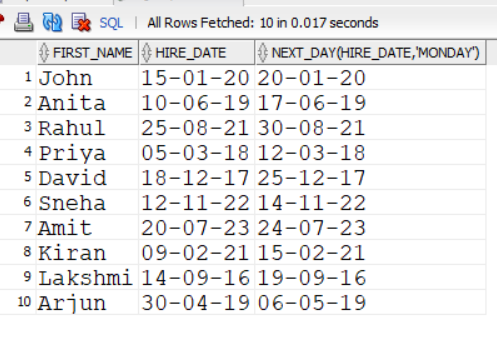
```
SELECT first_name, hire_date,
ADD_MONTHS(hire_date, 6)
FROM employees;
```
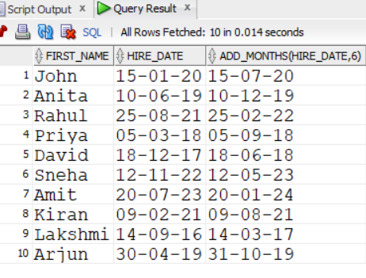
```
SELECT first_name, hire_date,
LAST_DAY(hire_date)
FROM employees;
```
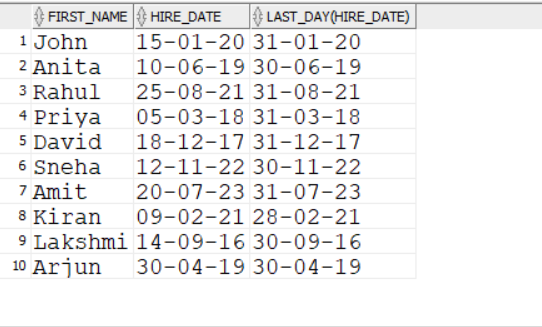
```

SELECT first_name,
MONTHS_BETWEEN(SYSDATE, hire_date)
FROM employees;
```

```
SELECT first_name, salary,
LEAST(salary, 60000)
FROM employees;
```

```

SELECT first_name, salary,
GREATEST(salary, 60000)
FROM employees;
```

```
SELECT first_name, hire_date,
TRUNC(hire_date, 'MONTH')
FROM employees;
```

```
SELECT first_name, hire_date,
ROUND(hire_date, 'MONTH')
FROM employees;
```
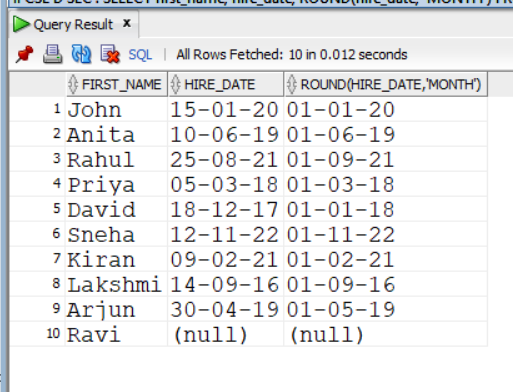
```
SELECT first_name,
TO_CHAR(hire_date, 'DAY, DD-MON-YYYY')
FROM employees;
```

```
SELECT *
FROM employees
WHERE hire_date < TO_DATE('01-JAN-2019', 'DD-MON-YYYY');
```


#EXPERIMENT 3B
```
select *from employees;
CREATE VIEW emp_view AS
SELECT *
FROM employees;
```

```
CREATE VIEW emp_basic AS
SELECT employee_id, first_name, last_name, department, salary
FROM employees;
```
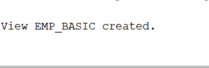
```
SELECT *
FROM emp_view;
```
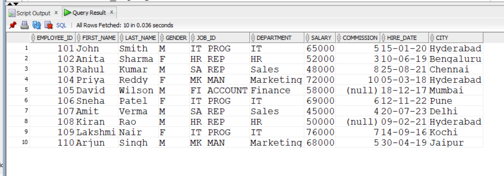
```
CREATE VIEW it_employees AS
SELECT *
FROM employees
WHERE department = 'IT';
```

```
CREATE VIEW high_salary AS
SELECT *
FROM employees
WHERE salary > 60000;
```

```
CREATE VIEW hyderabad_emp AS
SELECT *
FROM employees
WHERE city = 'Hyderabad';
```
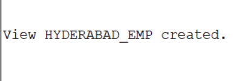
```
CREATE VIEW female_emp AS
SELECT *
FROM employees
WHERE gender = 'F';
```

```
CREATE VIEW recent_employees AS
SELECT *
FROM employees
WHERE hire_date >= TO_DATE('01-JAN-2020', 'DD-MON-YYYY');
```

```
SELECT employee_id, first_name, salary
FROM high_salary;
```
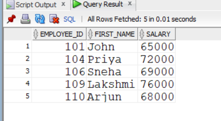
```
CREATE OR REPLACE VIEW emp_basic AS
SELECT employee_id, first_name, last_name, department, salary, city
FROM employees;
```

```
CREATE VIEW emp_salary_view AS
SELECT employee_id, first_name, last_name, salary
FROM employees
WITH READ ONLY;
```
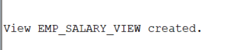
```
CREATE VIEW sales_emp AS
SELECT *
FROM employees
WHERE department = 'Sales'
WITH CHECK OPTION;
```

```
UPDATE emp_basic
SET salary = 70000
WHERE employee_id = 101;
```

```
DELETE FROM emp_view
WHERE employee_id = 107;
```

```
INSERT INTO emp_basic
(employee_id, first_name, last_name, department, salary, city)
VALUES
(111, 'Ravi', 'Kumar', 'IT', 55000, 'Hyderabad');
```

```
DESC emp_basic;
```

```
SELECT *
FROM it_employees;
```

```

SELECT *
FROM high_salary
WHERE salary > 70000;
```
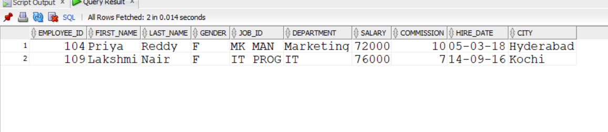
```
SELECT *
FROM female_emp;
```

```
SELECT first_name, salary
FROM hyderabad_emp;
```
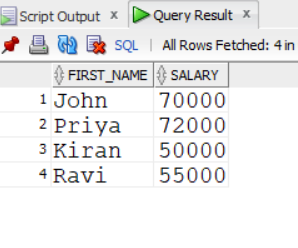
```
DROP VIEW emp_view;
```

```
DROP VIEW high_salary;
```

```

DROP VIEW emp_basic;
```

```
CREATE VIEW hr_employees AS
SELECT *
FROM employees
WHERE department = 'HR';
```
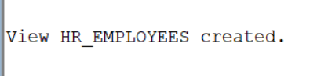
```
CREATE VIEW marketing_emp AS
SELECT employee_id, first_name, department, salary
FROM employees
WHERE department = 'Marketing';
```

```
CREATE VIEW top_earners AS
SELECT *
FROM employees
WHERE salary > 70000;
```

```

CREATE VIEW emp_city AS
SELECT employee_id, first_name, last_name, city
FROM employees;
```
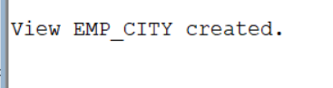

#experiment 4
```
CREATE TABLE dept (
    dno NUMBER(5),
    dname VARCHAR2(20)
);
```
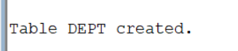
```
ALTER TABLE dept
ADD CONSTRAINT dept_pk PRIMARY KEY (dno);

ALTER TABLE dept
MODIFY dname CONSTRAINT dept_dname_nn NOT NULL;
```

```
CREATE TABLE student (
    sid NUMBER(5),
    sname VARCHAR2(30),
    did NUMBER(5)
);
```


```
ALTER TABLE student
ADD CONSTRAINT student_pk PRIMARY KEY (sid);

ALTER TABLE student
MODIFY sname CONSTRAINT student_sname_nn NOT NULL;

ALTER TABLE student
ADD CONSTRAINT student_dept_fk
FOREIGN KEY (did)
REFERENCES dept(dno);
```
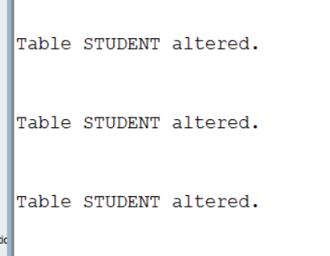
```
INSERT INTO dept VALUES (1, 'CSE');
INSERT INTO dept VALUES (2, 'ME');
INSERT INTO dept VALUES (3, 'CE');
INSERT INTO dept VALUES (4, 'EEE');
INSERT INTO dept VALUES (5, 'ECE');
INSERT INTO dept VALUES (6, 'CSM');
INSERT INTO dept VALUES (7, 'CSD');
```
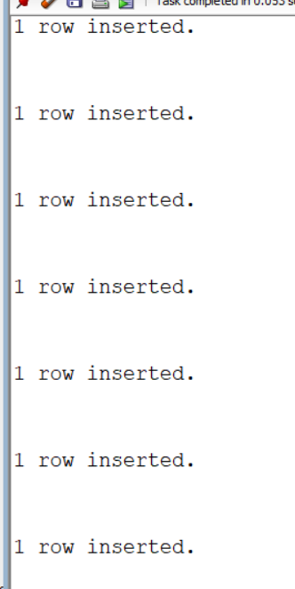
```
INSERT INTO student VALUES (101, 'Ravi', 1);
INSERT INTO student VALUES (102, 'Sita', 1);
INSERT INTO student VALUES (103, 'Rahul', 2);
INSERT INTO student VALUES (104, 'Priya', 3);
INSERT INTO student VALUES (105, 'Arjun', 4);
INSERT INTO student VALUES (106, 'Sneha', 5);
INSERT INTO student VALUES (107, 'Kiran', 6);
INSERT INTO student VALUES (108, 'Anita', 7);
INSERT INTO student VALUES (109, 'Ramesh', 1);
INSERT INTO student VALUES (110, 'Lakshmi', 5);
```

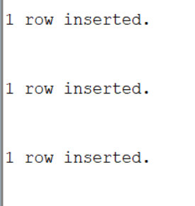
```
SELECT *
FROM student
NATURAL JOIN
(SELECT dno AS did, dname FROM dept);
```

```

SELECT *
FROM student s, dept d
WHERE s.did = d.dno;
```
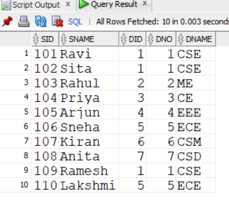
```
SELECT *
FROM student s
JOIN dept d
ON s.did = d.dno;
```

```
SELECT *
FROM student
NATURAL LEFT OUTER JOIN
(SELECT dno AS did, dname FROM dept);
```
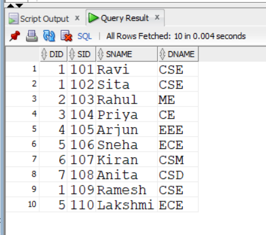
```
SELECT *
FROM student
NATURAL RIGHT OUTER JOIN
(SELECT dno AS did, dname FROM dept);
```

```
SELECT *
FROM student
NATURAL FULL OUTER JOIN
(SELECT dno AS did, dname FROM dept);
```
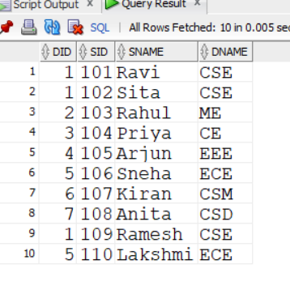
```
SELECT *
FROM student s
LEFT OUTER JOIN dept d
ON s.did = d.dno;
```

```
SELECT *
FROM student s
RIGHT OUTER JOIN dept d
ON s.did = d.dno;
```

```
SELECT *
FROM student s
FULL OUTER JOIN dept d
ON s.did = d.dno;
```
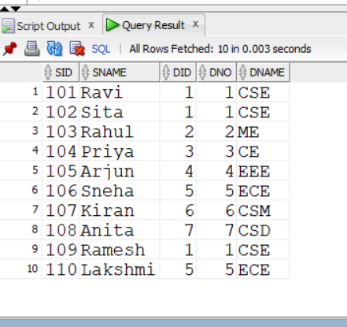
```
SELECT *
FROM student s
LEFT OUTER JOIN dept d
ON s.did = d.dno;
```

```
SELECT *
FROM student s
RIGHT OUTER JOIN dept d
ON s.did = d.dno;
```

```
SELECT *
FROM student s
FULL OUTER JOIN dept d
ON s.did = d.dno;
```

```
SELECT *
FROM student
CROSS JOIN dept;
```

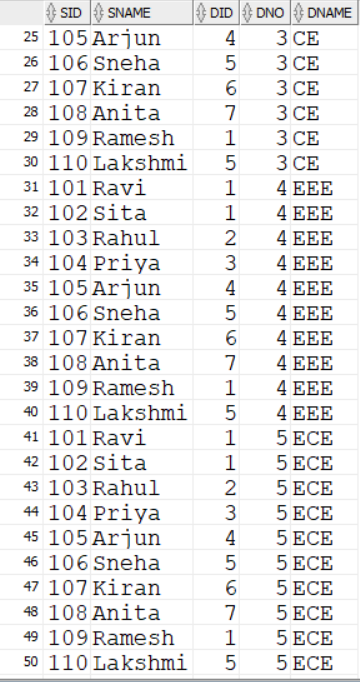
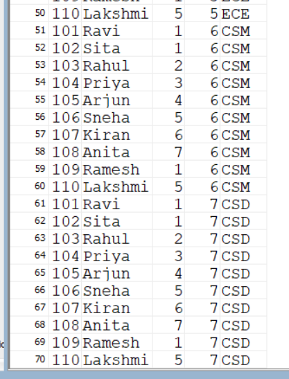


#virtual lab experiments 

```
 #ist experiments
```

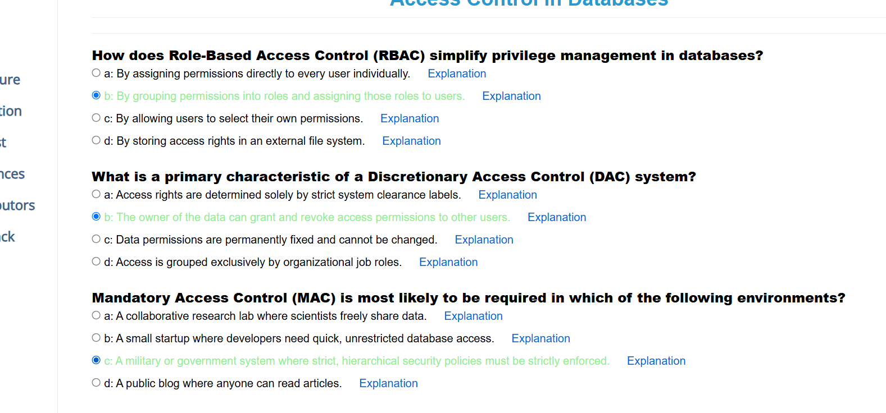

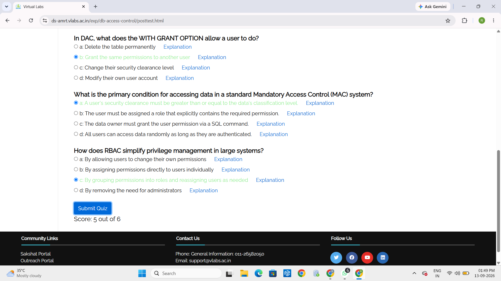

```
#2nd experiment
```
# 2nd experiment

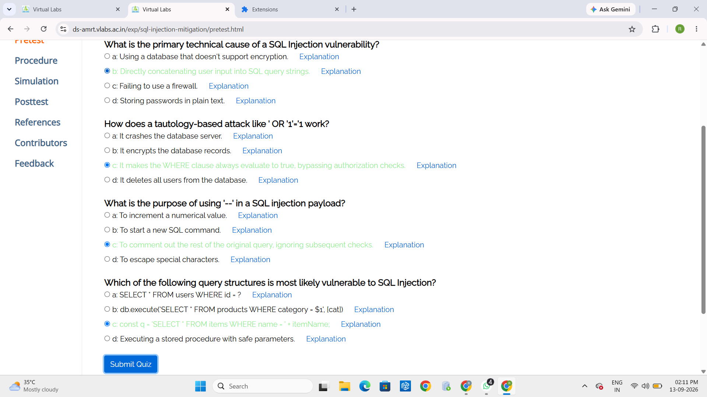


