#experiment 3 and 4
```
CREATE TABLE employees (
    employee_id NUMBER(5),
    first_name VARCHAR2(20),
    last_name VARCHAR2(20),
    gender CHAR(1),
    job_id VARCHAR2(15),
    department VARCHAR2(30),
    salary NUMBER(8,2),
    commission NUMBER(5,2),
    hire_date DATE,
    city VARCHAR2(20)
);

INSERT INTO employees VALUES
(101, 'John', 'Smith', 'M', 'IT_PROG', 'IT', 65000, 5,
TO_DATE('15-JAN-2020', 'DD-MON-YYYY'), 'Hyderabad');

INSERT INTO employees VALUES
(102, 'Anita', 'Sharma', 'F', 'HR_REP', 'HR', 52000, 3,
TO_DATE('10-JUN-2019', 'DD-MON-YYYY'), 'Bengaluru');

INSERT INTO employees VALUES
(103, 'Rahul', 'Kumar', 'M', 'SA_REP', 'Sales', 48000, 8,
TO_DATE('25-AUG-2021', 'DD-MON-YYYY'), 'Chennai');

INSERT INTO employees VALUES
(104, 'Priya', 'Reddy', 'F', 'MK_MAN', 'Marketing', 72000, 10,
TO_DATE('05-MAR-2018', 'DD-MON-YYYY'), 'Hyderabad');

INSERT INTO employees VALUES
(105, 'David', 'Wilson', 'M', 'FI_ACCOUNT', 'Finance', 58000, NULL,
TO_DATE('18-DEC-2017', 'DD-MON-YYYY'), 'Mumbai');

INSERT INTO employees VALUES
(106, 'Sneha', 'Patel', 'F', 'IT_PROG', 'IT', 69000, 6,
TO_DATE('12-NOV-2022', 'DD-MON-YYYY'), 'Pune');

INSERT INTO employees VALUES
(107, 'Amit', 'Verma', 'M', 'SA_REP', 'Sales', 45000, 4,
TO_DATE('20-JUL-2023', 'DD-MON-YYYY'), 'Delhi');

INSERT INTO employees VALUES
(108, 'Kiran', 'Rao', 'M', 'HR_REP', 'HR', 50000, NULL,
TO_DATE('09-FEB-2021', 'DD-MON-YYYY'), 'Hyderabad');

INSERT INTO employees VALUES
(109, 'Lakshmi', 'Nair', 'F', 'IT_PROG', 'IT', 76000, 7,
TO_DATE('14-SEP-2016', 'DD-MON-YYYY'), 'Kochi');


INSERT INTO employees VALUES
(110, 'Arjun', 'Singh', 'M', 'MK_MAN', 'Marketing', 68000, 5,
TO_DATE('30-APR-2019', 'DD-MON-YYYY'), 'Jaipur');
```
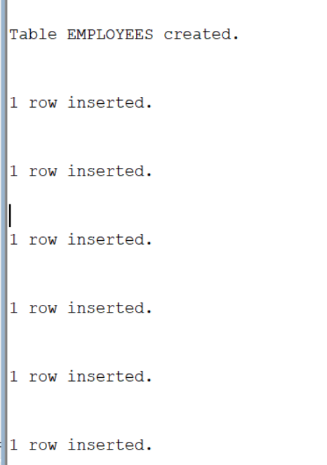
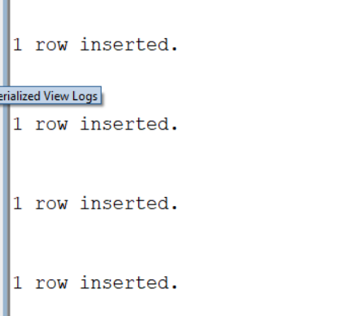

# 3a1 Q1. Write an SQL query to display the employee ID, first name, and hire date in the format DD-MON-YYYY using the TO_CHAR function.  
```

SELECT employee_id, first_name,
TO_CHAR(hire_date, 'DD-MON-YYYY')
FROM employees;
```

#3a2Q2. Write an SQL query to display the employee ID, first name, and salary formatted with a currency symbol using the TO_CHAR function.

```
SELECT employee_id, first_name,
TO_CHAR(salary, '$99,999.99')
FROM employees;
```


#3a3 Write an SQL query to add 5000 to each employee's salary using the TO_NUMBER function.
```

SELECT employee_id, first_name,
TO_NUMBER(TO_CHAR(salary)) + 5000
FROM employees;
```
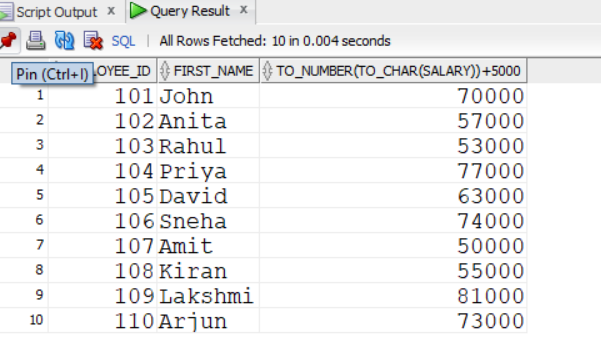
#3a4 Write an SQL query to display the details of employees who were hired after 01-JAN-2020 using the TO_DATE function.
```
SELECT *
FROM employees
WHERE hire_date > TO_DATE('01-JAN-2020', 'DD-MON-YYYY');
```

#3A5 Write an SQL query to display the full name of each employee by concatenating the first name and last name using the concatenation (||) operator.
```
SELECT first_name || ' ' || last_name
FROM employees;
```
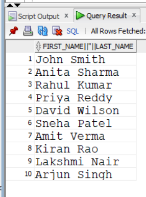
#3A6 Write an SQL query to concatenate the first name and last name of each employeeusing the CONCAT function.
```
SELECT CONCAT(first_name, last_name)
FROM employees;
```
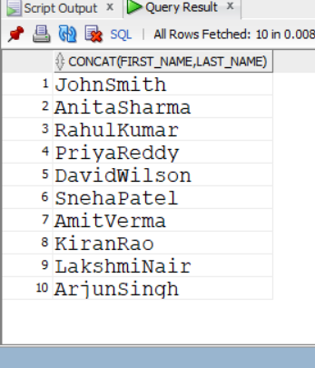
#3A7 Q7. Write an SQL query to display each employee's first name left-padded with * characters using the LPAD function.
```

SELECT LPAD(first_name, 20, '*')
FROM employees;
```
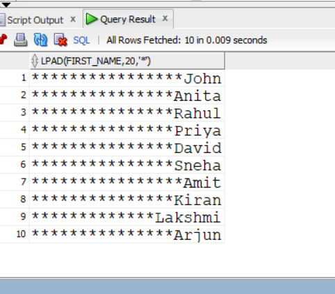
#3A8 Write an SQL query to display each employee's first name right-padded with * characters using the RPAD function.
```


SELECT RPAD(first_name, 20, '*')
FROM employees;
```
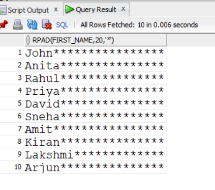
#3A9 Q9. Write an SQL query to remove leading spaces from employee names using the LTRIM function.
```
SELECT LTRIM(first_name)
FROM employees;
```
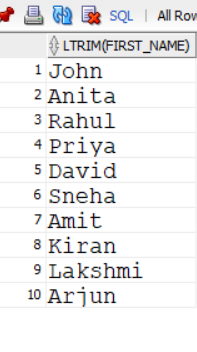
#3A10 Q10. Write an SQL query to remove trailing spaces from employee names using the RTRIM function.
```
SELECT RTRIM(first_name)
FROM employees;
```


#3A11 Q11. Write an SQL query to display all employee first names in lowercase using the LOWER function.
```
SELECT LOWER(first_name)
FROM employees;
```
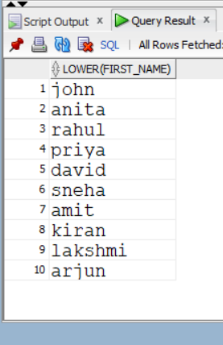
#3A12 Write an SQL query to display all employee first names in uppercase using the UPPER function.
```

SELECT UPPER(first_name)
FROM employees;
```

#3A13 Write an SQL query to display employee first names in proper case using the INITCAP function.
```

SELECT INITCAP(first_name)
FROM employees;
```
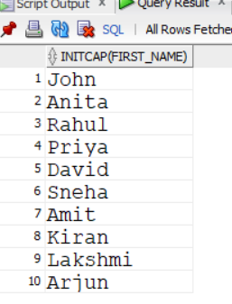
#3A14 Write an SQL query to display the length of each employee's first name using the LENGTH function.
```

SELECT first_name, LENGTH(first_name)
FROM employees;
```
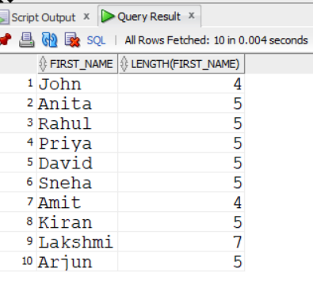
#3A15 Write an SQL query to display the first three characters of each employee's first name using the SUBSTR function.
```
SELECT first_name, SUBSTR(first_name, 1, 3)
FROM employees;
```
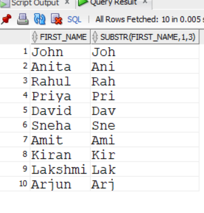
#3A16 Write an SQL query to find the position of the character 'a' in each employee's first name using the INSTR function.
```
SELECT first_name, INSTR(first_name, 'a')
FROM employees;
```

#3A17 Write an SQL query to display the current system date along with each employee's details using the SYSDATE function.
```

SELECT employee_id, first_name, last_name, SYSDATE
FROM employees;
```

#3A18 Write an SQL query to display the next Monday after each employee's hire date using the NEXT_DAY function.
```
SELECT first_name, hire_date,
NEXT_DAY(hire_date, 'MONDAY')
FROM employees;
```

#3A19 Write an SQL query to display the date obtained by adding six months to each employee's hire date using the ADD_MONTHS function.
```
SELECT first_name, hire_date,
ADD_MONTHS(hire_date, 6)
FROM employees;
```

#3A20 Write an SQL query to display the last day of the month for each employee's hire date using the LAST_DAY function.
```
SELECT first_name, hire_date,
LAST_DAY(hire_date)
FROM employees;
```

#3A21 Write an SQL query to calculate the total number of months each employee has worked using the MONTHS_BETWEEN function.
```


SELECT first_name,
MONTHS_BETWEEN(SYSDATE, hire_date)
FROM employees;
```
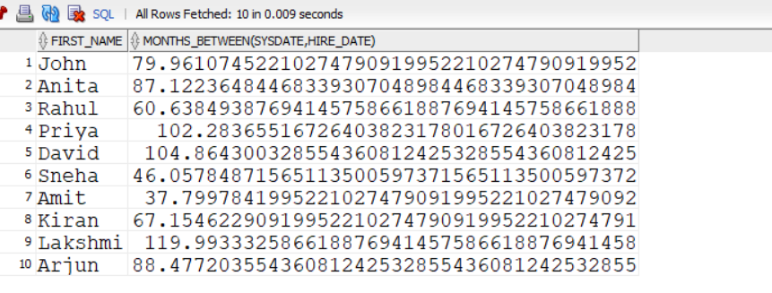
#3A22 Write an SQL query to display the smaller value between each employee's salary and 60000 using the LEAST function.
```
SELECT first_name, salary,
LEAST(salary, 60000)
FROM employees;
```
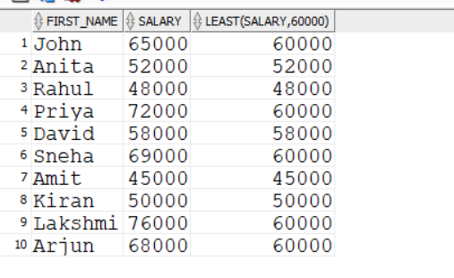
#3A23 Write an SQL query to display the greater value between each employee's salary and 60000 using the GREATEST function.
```

SELECT first_name, salary,
GREATEST(salary, 60000)
FROM employees;
```
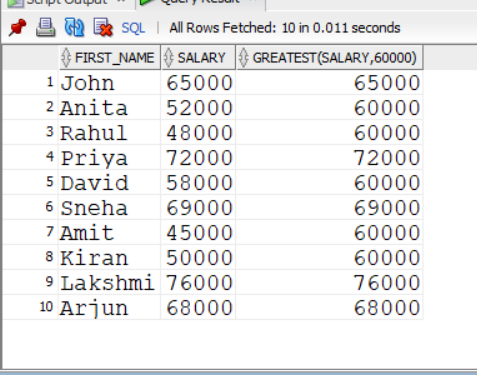
#3A24 Write an SQL query to display the first day of the month of each employee's hiredate using the TRUNC function.
```
SELECT first_name, hire_date,
TRUNC(hire_date, 'MONTH')
FROM employees;
```
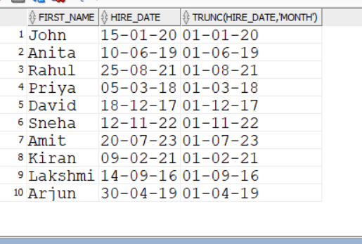
#3A25 Write an SQL query to round each employee's hire date to the nearest month using the ROUND function.
```
SELECT first_name, hire_date,
ROUND(hire_date, 'MONTH')
FROM employees;
```

#3A26 Write an SQL query to display each employee's hire date in the format DAY, DD-MON-YYYY using the TO_CHAR function.
```
SELECT first_name,
TO_CHAR(hire_date, 'DAY, DD-MON-YYYY')
FROM employees;
```
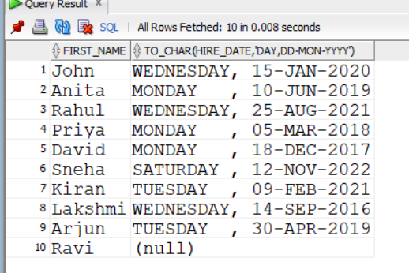
#3A27 Write an SQL query to display the details of employees who were hired before 01-JAN-2019 using the TO_DATE function.
```
SELECT *
FROM employees
WHERE hire_date < TO_DATE('01-JAN-2019', 'DD-MON-YYYY');
```
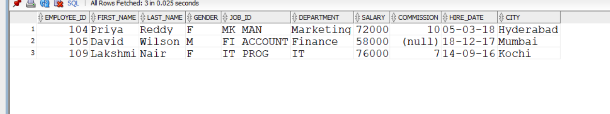


#EXPERIMENT 3B
#3B1 Q1.Write an SQL query to create a view named EMP_VIEW that displays all columns from the EMPLOYEES table.
```
select *from employees;
CREATE VIEW emp_view AS
SELECT *
FROM employees;
```

#3B2 Q2. Write an SQL query to create a view named EMP_BASIC that displays the Employee ID, First Name, Last Name, Department, and Salary.
```
CREATE VIEW emp_basic AS
SELECT employee_id, first_name, last_name, department, salary
FROM employees;
```

#3B3 write an sql query to display all records from the EMP_VIEW
```
SELECT *
FROM emp_view;
```

#3B4 Q4.Write an SQL query to create a view named IT_EMPLOYEES that displays tghe details of employees working in the IT department
```
CREATE VIEW it_employees AS
SELECT *
FROM employees
WHERE department = 'IT';
```
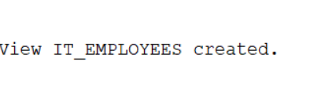
#3B5 Write an SQL query to create a view named HIGH_SALARY that displays employees whose salary is greater than ₹60,000.
```
CREATE VIEW high_salary AS
SELECT *
FROM employees
WHERE salary > 60000;
```

#3B6 Q6.Write an SQL query to create a view named HYDERABAD_EMP that displays employees whose city is Hyderabad.
```
CREATE VIEW hyderabad_emp AS
SELECT *
FROM employees
WHERE city = 'Hyderabad';
```

#3B7 Q7.Write an SQL query to create a view named FEMALE_EMP that displays the details of all female employees.
```
CREATE VIEW female_emp AS
SELECT *
FROM employees
WHERE gender = 'F';
```

#3B8 Q8.Write an SQL query to create a view named RECENT_EMPLOYEES that displays employees hired on or after 01-JAN-2020.
```
CREATE VIEW recent_employees AS
SELECT *
FROM employees
WHERE hire_date >= TO_DATE('01-JAN-2020', 'DD-MON-YYYY');
```

#3B9 Q9.Write an SQL query to display the Employee ID, First Name, and Salary from the HIGH_SALARY view.
```
SELECT employee_id, first_name, salary
FROM high_salary;
```

#3B10 Q10.Write an SQL query to replace the EMP_BASIC view by adding the CITY columnusing the CREATE OR REPLACE VIEW statement.
```
CREATE OR REPLACE VIEW emp_basic AS
SELECT employee_id, first_name, last_name, department, salary, city
FROM employees;
```
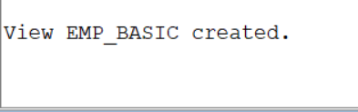

#3B11 Q11.Write an SQL query to create a read-only view named EMP_SALARY_VIEW thatdisplays the Employee ID, First Name, Last Name, and Salary.
```
CREATE VIEW emp_salary_view AS
SELECT employee_id, first_name, last_name, salary
FROM employees
WITH READ ONLY;
```

#3B12 Q12.Write an SQL query to create a view named SALES_EMP that displays employees belonging to the Sales department using the WITH CHECK OPTION clause.
```
CREATE VIEW sales_emp AS
SELECT *
FROM employees
WHERE department = 'Sales'
WITH CHECK OPTION;
```
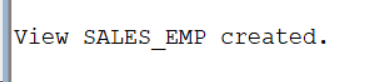
#3B13 Q13.Write an SQL query to update the salary of employee 101 through theEMP_BASIC view.
```
UPDATE emp_basic
SET salary = 70000
WHERE employee_id = 101;
```
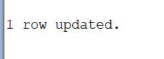

#3B14 Q14.Write an SQL query to delete the details of employee 107 through theEMP_VIEW.
```
DELETE FROM emp_view
WHERE employee_id = 107;
```
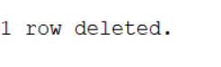
#3B15 Write an sql query to insert  a new wmployee into the EMP_BASIC view
```
INSERT INTO emp_basic
(employee_id, first_name, last_name, department, salary, city)
VALUES
(111, 'Ravi', 'Kumar', 'IT', 55000, 'Hyderabad');
```

#3B16 Q16.Write an SQL query to display the structure of the EMP_BASIC view.
```
DESC emp_basic;
```
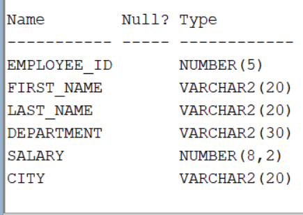
#3B17 Q17.Write an SQL query to display all records from the IT_EMPLOYEES view.
```
SELECT *
FROM it_employees;
```
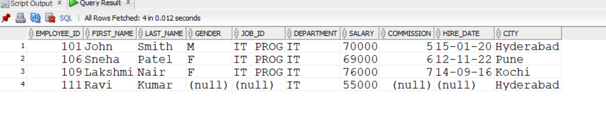
#3B18 Q18.Write an SQL query to display employees from the HIGH_SALARY view whosesalary is greater than ₹70,000.
```

SELECT *
FROM high_salary
WHERE salary > 70000;
```

#3B19 Q19.Write an SQL query to display all female employees from the FEMALE_EMPview.
```
SELECT *
FROM female_emp;
```
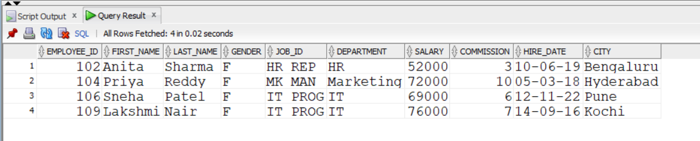

#3B20 Q20.Write an SQL query to display the names and salaries of employees from theHYDERABAD_EMP view.
```
SELECT first_name, salary
FROM hyderabad_emp;
```

#3B21 Q21.Write an SQL query to drop the EMP_VIEW.
```
DROP VIEW emp_view;
```
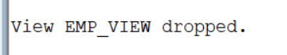
#3B22 Q22.Write an SQL query to drop the HIGH_SALARY view.
```
DROP VIEW high_salary;
```

#3B23 Q23.Write an SQL query to drop the EMP_BASIC view.
```

DROP VIEW emp_basic;
```
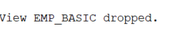
#3B24 Q24.Write an SQL query to create a view named HR_EMPLOYEES that displays employees working in the HR department.
```
CREATE VIEW hr_employees AS
SELECT *
FROM employees
WHERE department = 'HR';
```

#3B25 Q25.Write an SQL query to create a view named MARKETING_EMP that displaysthe Employee ID, First Name, Department, and Salary of employees working in theMarketing department.
```
CREATE VIEW marketing_emp AS
SELECT employee_id, first_name, department, salary
FROM employees
WHERE department = 'Marketing';
```

#3B26 Q26.Write an SQL query to create a view named TOP_EARNERS that displays employees earning more than ₹70,000.
```
CREATE VIEW top_earners AS
SELECT *
FROM employees
WHERE salary > 70000;
```

#3B27 Q27.Write an SQL query to create a view named EMP_CITY that displays the Employee ID, First Name, Last Name, and City of all employees.
```

CREATE VIEW emp_city AS
SELECT employee_id, first_name, last_name, city
FROM employees;
```


