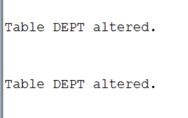
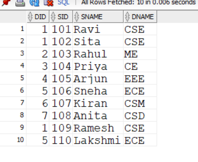
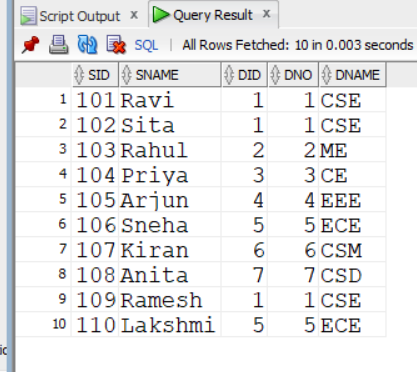
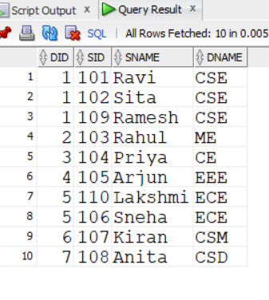
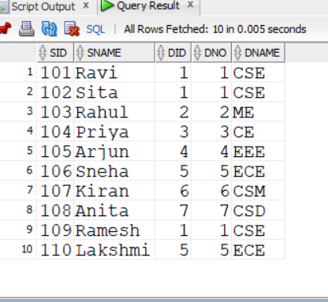
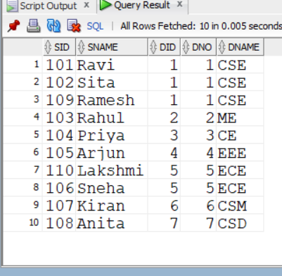
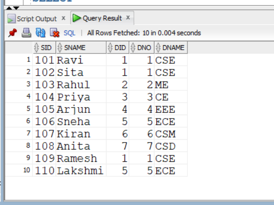
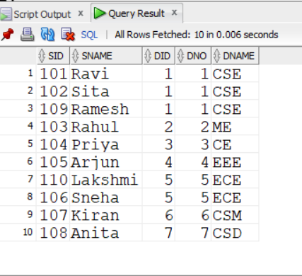
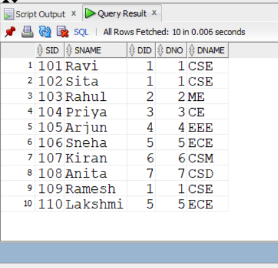
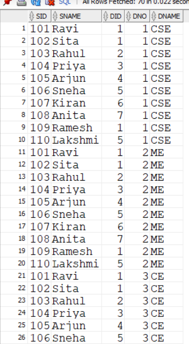

#EXPERIMENT 4
#1.Create a dept table having dno, dname as columns.
```
CREATE TABLE dept (
    dno NUMBER(5),
    dname VARCHAR2(20)
);
```

#2.Apply 'Primary Key Constraint' for dno and NOT NULL Constraint for dname to dept table
```
ALTER TABLE dept
ADD CONSTRAINT dept_pk PRIMARY KEY (dno);

ALTER TABLE dept
MODIFY dname CONSTRAINT dept_dname_nn NOT NULL;
```

#3.Create a Student table having sid, sname, and did as columns.
```
CREATE TABLE student (
    sid NUMBER(5),
    sname VARCHAR2(30),
    did NUMBER(5)
);
```


#4.Apply Primary Key Constraint to sid, NOT NULL Constraint to Sname and Foreign Key Constraint to did refers to dept table
```
ALTER TABLE student
ADD CONSTRAINT student_pk PRIMARY KEY (sid);

ALTER TABLE student
MODIFY sname CONSTRAINT student_sname_nn NOT NULL;

ALTER TABLE student
ADD CONSTRAINT student_dept_fk
FOREIGN KEY (did)
REFERENCES dept(dno);
```

#5.Insert all department details like cse, me, ce, eee, ece, csm, csd in the dept table.
```
INSERT INTO dept VALUES (1, 'CSE');
INSERT INTO dept VALUES (2, 'ME');
INSERT INTO dept VALUES (3, 'CE');
INSERT INTO dept VALUES (4, 'EEE');
INSERT INTO dept VALUES (5, 'ECE');
INSERT INTO dept VALUES (6, 'CSM');
INSERT INTO dept VALUES (7, 'CSD');
```

#6.Insert atleast 10 rows in the student table, take values of your own
```
INSERT INTO student VALUES (101, 'Ravi', 1);
INSERT INTO student VALUES (102, 'Sita', 1);
INSERT INTO student VALUES (103, 'Rahul', 2);
INSERT INTO student VALUES (104, 'Priya', 3);
INSERT INTO student VALUES (105, 'Arjun', 4);
INSERT INTO student VALUES (106, 'Sneha', 5);
INSERT INTO student VALUES (107, 'Kiran', 6);
INSERT INTO student VALUES (108, 'Anita', 7);
INSERT INTO student VALUES (109, 'Ramesh', 1);
INSERT INTO student VALUES (110, 'Lakshmi', 5);
```


#7.Write a SQL Query to implement NATURAL JOIN between Student and Dept.

```
SELECT *
FROM student
NATURAL JOIN
(SELECT dno AS did, dname FROM dept);
```

#8.Write a SQL Query to implement EQUI JOIN between Student and Dept.
```
SELECT *
FROM student s, dept d
WHERE s.did = d.dno;
```

#9.Write a SQL Query to implement CONDITIONAL JOIN between Student and Dept.
```
SELECT *
FROM student s
JOIN dept d
ON s.did = d.dno;
```

#10.Write a SQL Query to implement LEFT OUTER NATURAL JOIN between Student and Dept.
```
SELECT *
FROM student
NATURAL LEFT OUTER JOIN
(SELECT dno AS did, dname FROM dept);
```

#11.Write a SQL Query to implement RIGHT OUTER NATURAL JOIN between Student and Dept.
```
SELECT *
FROM student
NATURAL RIGHT OUTER JOIN
(SELECT dno AS did, dname FROM dept);
```

#12.Write a SQL Query to implement FULL OUTER NATURAL JOIN between Student and Dept.
```
SELECT *
FROM student
NATURAL FULL OUTER JOIN
(SELECT dno AS did, dname FROM dept);
```

#13Write a SQL Query to implement LEFT OUTER EQUI JOIN between Student and Dept.
```
SELECT *
FROM student s
LEFT OUTER JOIN dept d
ON s.did = d.dno;
```

#14.Write a SQL Query to implement RIGHT OUTER EQUI JOIN between Student and Dept.
```
SELECT *
FROM student s
RIGHT OUTER JOIN dept d
ON s.did = d.dno;
```

#15.Write a SQL Query to implement FULL OUTER EQUI JOIN between Student and Dept.
```
SELECT *
FROM student s
FULL OUTER JOIN dept d
ON s.did = d.dno;
```

#16.Write a SQL Query to implement LEFT OUTER CONDITIONAL JOIN between Student and Dept.
```
SELECT *
FROM student s
LEFT OUTER JOIN dept d
ON s.did = d.dno;
```


#17.Write a SQL Query to implement RIGHT OUTER CONDITIONAL JOIN between Student and Dept.

```
SELECT *
FROM student s
RIGHT OUTER JOIN dept d
ON s.did = d.dno;
```

#18.Write a SQL Query to implement FULL OUTER CONDITIONAL JOIN between Student and Dept.
```
SELECT *
FROM student s
FULL OUTER JOIN dept d
ON s.did = d.dno;
```

#19.Write a SQL Query to Implement CROSS JOIN between Student and Dept.
```
SELECT *
FROM student
CROSS JOIN dept;
```



